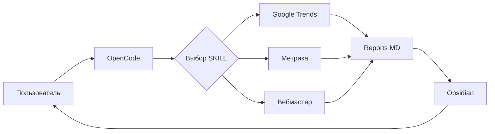
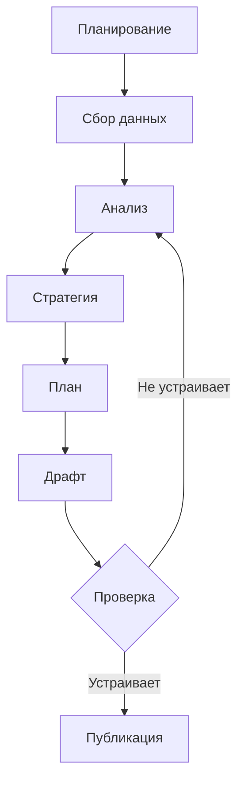

# План статьи: SKILLs в OpenCode

**Дата:** 2026-03-06
**Рабочее название:** "SKILLs в OpenCode: процессный подход к созданию контента"

---

## Рабочее название

### Основное

**"SKILLs в OpenCode: процессный подход к созданию контента"** (56 символов)

### Альтернативы

1. "Как я выстроил процесс создания статей с SKILLs в OpenCode" (62 символа)
2. "OpenCode + SKILLs: data-driven подход к блогу" (48 символов)
3. "Автоматизация аналитики блога с SKILLs в OpenCode" (53 символа)

**Выбор:** Основное — ключевые слова + длина + ясность

---

## Целевая аудитория

### Первичная

- **AI-разработчики** (25-40 лет, Россия) — интересуются AI agents, automation
- **Технические блогеры** — тратят много времени на аналитику
- **AI-энтузиасты** — хотят попробовать OpenCode, GLM-5

### Портрет читателя

**Иван, 32 года, Москва**
- Разработчик, ведёт технический блог
- Пробовал Claude Code, Cursor AI
- Ищет системные методы работы с AI
- Хочет снизить время на рутину

---

## Ключевые слова

### Основное

- **SKILLs в OpenCode** (H1, первый абзац, meta title)

### Вторичные

- процесс создания контента
- GLM-5
- data-driven подход
- автоматизация контента
- Kilo Code

### Трендовые

- OpenCode
- Claude Code
- AI agents
- automation
- workflow

---

## Структура

### 1. Введение (200 слов)

**Хук:** "Я провёл эксперимент: попросил AI-агента написать статью про... AI-агентов"

**Проблема:**
- Создание качественного контента требует много времени на анализ
- Я трачу часы на сбор данных из Яндекс.Метрики, Google Trends
- Нет системного подхода — каждый раз с нуля

**Решение:**
- Применил процессный подход (как в коде) к созданию статей
- Написал SKILLs для OpenCode для автоматизации аналитики
- Результат не идеален, но процесс можно улучшать

**Цель блога:** Привлекать аудиторию для проекта [task.ai-aid.pro](https://task.ai-aid.pro)

---

### 2. Проблема: хаос вместо процесса (300 слов)

**Ситуация:**
- Для кода у меня есть процесс: [task-agents-playbook](https://github.com/prikotov/task-agents-playbook)
- Для статей — хаос: собираю данные вручную, анализирую в уме, пишу "как пойдёт"
- Результат непредсказуем, качество нестабильно

**Вопрос:**
- А что если применить такой же подход к статьям?
- Выстроить процесс, который можно улучшать?

**Гипотеза:**
- SKILLs в AI-агентах могут помочь систематизировать процесс
- Можно автоматизировать сбор данных
- Можно улучшать процесс итеративно

---

### 3. Эксперимент: OpenCode + GLM-5 + SKILLs (500 слов)

**Выбор инструментов:**

| Критерий | Выбор | Почему |
|----------|-------|--------|
| **AI-агент** | OpenCode | Аналог Claude Code, активно развивается |
| **LLM-модель** | GLM-5 | Понравился результат в [предыдущем опыте](https://prikotov.pro/blog/pervyi-opyt-s-glm-5-koding-cherez-kilo-code) |
| **Формат** | Markdown + Obsidian | Гибкость, плагины, синергия с AI |

**Что сделал:**

1. **Написал SKILLs для аналитики** (3 дня между перерывами)
   - Google Trends
   - Яндекс.Метрика (pages, traffic, search, visitors)
   - Яндекс.Вебмастер (queries)

2. **Создал процесс в AGENTS.md**
   - Этапы: планирование → сбор → анализ → стратегия → драфт
   - Шаблоны, чек-листы, примеры

3. **Провёл тестовый речерч**
   - Собрал данные
   - Получил драфт
   - Сказал себе СТОП — не было процесса

4. **Описал процесс формально**
   - Зафиксировал в AGENTS.md
   - Создал SKILL для написания статей

5. **Перезапустил агента**
   - Новая сессия, загружены skills
   - Запрос на написание статьи
   - Результат — то, что вы читаете

**Важно:** Skills открытые, можно брать и адаптировать.

---

### 4. SKILLs: что это и как работает (800 слов)

**Концепция:**

SKILLs — это набор инструкций и инструментов для AI-агента, которые:
- Определяют порядок действий
- Предоставляют доступ к данным
- Форматируют результаты

**Архитектура:**



**Примеры skills:**

#### Google Trends

```bash
python3 .opencode/skills/google-trends/trends.py -g RU "opencode" "claude code"
```

**Результат:** MD-файл с данными о трендах

#### Яндекс.Метрика

```bash
php .opencode/skills/yandex-metrika-pages/pages.php -l 20
```

**Результат:** Топ-20 страниц блога с метриками

#### Яндекс.Вебмастер

```bash
php .opencode/skills/yandex-webmaster-queries/queries.php -l 30
```

**Результат:** Топ-30 поисковых запросов с CTR

**Почему это круто:**

1. **Автоматизация** — не нужно вручную собирать данные
2. **Структура** — результаты в MD-формате, легко читать в Obsidian
3. **Гибкость** — можно адаптировать под свой проект
4. **Открытость** — skills на GitHub, берите и используйте

---

### 5. Процесс: от данных до статьи (600 слов)

**Этапы процесса (из AGENTS.md):**



#### Этап 1: Планирование сбора данных

**Цель:** Понять какие данные нужны и откуда.

**Шаги:**
1. Определить тему статьи
2. Составить список вопросов
3. Выбрать skills для использования
4. Зафиксировать план в файл

**Результат:** `01 - План исследования.md`

#### Этап 2: Сбор данных

**Цель:** Собрать сырые данные из всех источников.

**Порядок:**
1. Google Trends — сначала (макро-тренды)
2. Яндекс.Метрика — статистика блога
3. Яндекс.Вебмастер — SEO-анализ

**Результат:** Папка с отчётами `YYYY-MM-DD/`

#### Этап 3: Обработка данных и инсайты

**Цель:** Превратить данные в выводы.

**Анализ:**
- Тренды: что растёт, что падает
- Текущая ситуация: что заходит, что нет
- Связи: разрывы между трендами и контентом

**Результат:** `02 - Инсайты.md`

#### Этап 4: Стратегия статьи

**Цель:** Определить как статья достигнет целей.

**Вопросы:**
- Целевая аудитория
- Ключевые слова
- Позиционирование
- Связь с task.ai-aid.pro

**Результат:** `03 - Стратегия статьи.md`

#### Этап 5: План статьи

**Цель:** Создать структуру до написания.

**Элементы:**
- Заголовок
- Секции с ключевыми мыслями
- Примеры, данные
- SEO-мета

**Результат:** `04 - План статьи.md`

#### Этап 6: Драфт статьи

**Цель:** Написать первый черновик.

**Принципы:**
- Честный голос: "Я попробовал..."
- Практичность: код, который работает
- Структура: короткие абзацы, подзаголовки

**Результат:** `05 - Статья (драфт).md`

---

### 6. Результат: что получилось (400 слов)

**Что сработало:**

1. **Процесс работает**
   - Агент следует этапам
   - Данные собираются автоматически
   - Результаты структурированы

2. **Data-driven подход**
   - Статья основана на данных, не на догадках
   - Можно проверить источники
   - Можно улучшать на основе метрик

3. **Открытость**
   - Skills доступны на GitHub
   - AGENTS.md опубликован
   - Можно адаптировать под себя

**Что можно улучшить:**

1. **Качество анализа**
   - Инсайты можно глубже
   - Больше связей между данными

2. **Визуализация**
   - Больше диаграмм
   - Скриншоты, примеры

3. **SEO-оптимизация**
   - Более точные ключевые слова
   - Лучше сниппеты

**Главный инсайт:**

> SKILLs — это не про идеальный результат, а про процесс, который можно улучшать.

---

### 7. Выводы: процесс > результат (200 слов)

**Что я понял:**

1. **SKILLs — это мощно**
   - Автоматизация мышления
   - Системный подход
   - Возможность улучшения

2. **Процесс важнее результата**
   - Идеальный результат недостижим
   - Улучшаемый процесс — реально

3. **AI-агент — не замена, а помощник**
   - Направляйте агента
   - Улучшайте процесс вместе с ним
   - Используйте как точку зрения

**Что дальше:**

- Продолжать улучшать процесс
- Добавлять новые skills
- Измерять качество статей

**CTA:**

Skills открыты, берите и адаптируйте под свой проект. Попросите агента настроить их — это реально впечатляет.

---

## Визуальные элементы

### Mermaid диаграммы

1. **Архитектура skills** (в секции 4)
   - Flowchart: OpenCode → Skills → APIs → Reports → Obsidian

2. **Процесс создания статьи** (в секции 5)
   - Flowchart: Планирование → Сбор → Анализ → Стратегия → План → Драфт → Публикация

3. **Цикл улучшения** (в выводах)
   - Flowchart: Процесс → Результат → Анализ → Улучшение → Процесс

### OG-изображение

**Промпт:**
```
Modern tech blog post cover image, horizontal banner 1200x630, AI agent working with markdown files and data visualizations, automation workflow concept, clean minimalist design, blue and purple gradient background, glowing elements, OpenCode and GLM-5 branding, futuristic tech aesthetic, no text, high quality render
```

### Скриншоты (опционально)

- Пример MD-отчёта из Яндекс.Метрики
- Пример кода skills
- Скриншот Obsidian с отчётами

---

## SEO-мета

### Title

**"SKILLs в OpenCode: процессный подход к созданию контента"** (56 символов)

### Description

**"Как я выстроил процесс создания статей с SKILLs в OpenCode. Data-driven подход, открытые skills для аналитики блога. Эксперимент с GLM-5, честные выводы."** (158 символов)

### Ключевые слова

- SKILLs в OpenCode
- процесс создания контента
- GLM-5
- data-driven подход
- автоматизация контента
- OpenCode
- AI agents

---

## Ссылки

### Обязательные

1. [task-agents-playbook](https://github.com/prikotov/task-agents-playbook) — процесс для кода
2. [task.ai-aid.pro](https://task.ai-aid.pro) — цель блога
3. [Статья про GLM-5](https://prikotov.pro/blog/pervyi-opyt-s-glm-5-koding-cherez-kilo-code) — предыдущий опыт
4. [Skills на GitHub](https://github.com/prikotov/skills) — открытые skills (нужно создать)

### Контекстные

5. [Блог prikotov.pro](https://prikotov.pro)
6. [Obsidian](https://obsidian.md) — заметки
7. [OpenCode](https://opencode.ai) — AI-агент (если есть сайт)

---

## Чек-лист перед публикацией

### Контент

- [ ] Заголовок содержит "SKILLs" и "OpenCode"
- [ ] Введение цепляет (эксперимент → проблема → решение)
- [ ] Есть личная история (3 дня между перерывами)
- [ ] Есть практические примеры (код, команды)
- [ ] Есть связь с task.ai-aid.pro (естественная)
- [ ] Заключение с CTA (мягкий)

### SEO

- [ ] Title оптимизирован (56 символов)
- [ ] Description с хуком (158 символов)
- [ ] Ключевые слова в H1, H2, H3
- [ ] Alt-тексты для изображений (если будут)

### Техническое

- [ ] Mermaid диаграммы работают (кириллица в кавычках)
- [ ] Код проверен и работает
- [ ] Ссылки валидны
- [ ] GitHub репозиторий skills существует

### Визуальное

- [ ] OG-изображение подготовлено
- [ ] Диаграммы читаемые

---

## Следующий шаг

**Драфт статьи** — написать первый черновик по плану.
