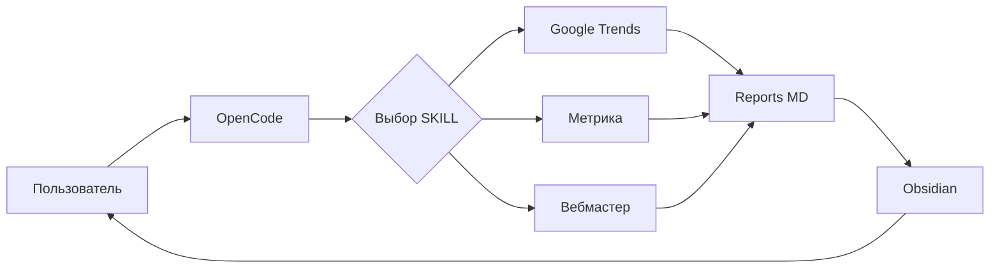
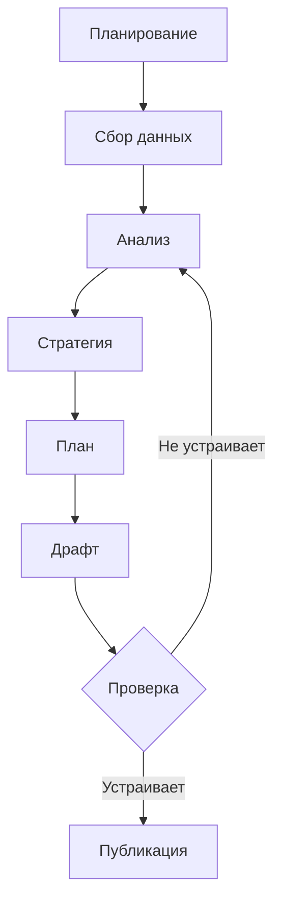

# SKILLs в OpenCode: процессный подход к созданию контента

<!-- OG-изображение: Modern tech blog post cover image, horizontal banner 1200x630, AI agent working with markdown files and data visualizations, automation workflow concept, clean minimalist design, blue and purple gradient background, glowing elements, OpenCode and GLM-5 branding, futuristic tech aesthetic, no text, high quality render -->

Я провёл эксперимент: попросил AI-агента написать статью про... AI-агентов.

Звучит как начало шутки, но это серьёзно. Я пытался понять, как организовать процесс создания статей для блога так, чтобы тратить на него меньше времени, но получать более качественный результат.

Мой блог [prikotov.pro](https://prikotov.pro) помогает привлекать аудиторию для проекта [task.ai-aid.pro](https://task.ai-aid.pro). Для этого мне нужно писать статьи, которые заходят читателям. Проблема в том, что я трачу много времени на сбор данных из Яндекс.Метрики, Google Trends, Вебмастера — пытаюсь понять что заходит аудитории, что нет, и почему.

Для кода у меня уже есть процесс: [task-agents-playbook](https://github.com/prikotov/task-agents-playbook). Качество кода на выходе меня устраивает, и я чётко понимаю что делать дальше, чтобы процесс улучшать. И я подумал: а что если применить такой же подход к созданию статей?

Я провёл эксперимент с SKILLs в OpenCode + GLM-5. Результат не идеален, но то, что процесс можно выстроить и улучшать — это здорово. Этим экспериментом я хочу поделиться.

## Проблема: хаос вместо процесса

Когда я пишу статью, у меня нет системы. Каждый раз я:

1. Думаю "о чём бы написать"
2. Иду в Яндекс.Метрику, смотрю что заходило
3. Проверяю Google Trends на тренды
4. Анализирую в уме (потому что не систематизировано)
5. Пишу статью "как пойдёт"

Результат непредсказуем. Качество нестабильно. Время на рутину — огромное.

При этом для кода у меня есть чёткий процесс. Я описал его в [task-agents-playbook](https://github.com/prikotov/task-agents-playbook), и он работает. Агент следует этапам, я направляю, мы вместе улучшаем.

И вот я подумал: а что если к статьям применить такой же подход?

**Гипотеза:** SKILLs в AI-агентах могут помочь систематизировать процесс создания статей. Можно автоматизировать сбор данных, выстроить этапы, и улучшать процесс итеративно.

## Эксперимент: OpenCode + GLM-5 + SKILLs

### Выбор инструментов

Я выбрал **OpenCode** как AI-агента, потому что его очень хвалят как аналог Claude Code. Активно развивается, open source, удобный. Плюс хотел получить опыт работы с ним.

**GLM-5** выбрал как модель, потому что мне очень понравился результат в паре с ней по моему процессу кодирования. Об этом я писал в статье [Первый опыт с GLM-5: кодинг через Kilo Code](https://prikotov.pro/blog/pervyi-opyt-s-glm-5-koding-cherez-kilo-code).

**Obsidian** как среду для заметок. Я очень люблю Obsidian: он работает с markdown, гибкий, настраивается плагинами. И получается крутая синергия от AI-агента + MD-файла + Obsidian. Поэтому я просил агента все результаты оформлять как MD-файлы.

### Что я сделал

**Первое.** Я поискал готовые skills для сбора аналитики по блогу и трендам. Ничего особо не нашёл.

**Второе.** Решил написать сам. В течение 3 дней, между перерывами пока Codex писал код для TasK, я в том же OpenCode + GLM-5 написал skills для него:

- **Google Trends** — анализ трендов поиска
- **Яндекс.Метрика** — pages, traffic, search, visitors
- **Яндекс.Вебмастер** — поисковые запросы

Skills открыты, можно их брать и пользоваться. Менять под себя легко — попросите агента, он вам их поставит, настроит и допишет нужный функционал. Я так это делал, это реально впечатляет.

**Третье.** Вчера я провёл тестовый речерч. Попросил агента собрать данные и написать драфт статьи. Агент сделал сам что считал нужным, и результат сделал такой какой посчитал нужным.

И я сказал себе СТОП. Потому что не было процесса. Агент действовал хаотично, без структуры.

**Четвёртое.** Сегодня с утра я попросил агента по результату вчерашней сессии сформировать процесс работы над статьей. Накидал ему основные моменты, которые стоит закрепить. Агент описал это в AGENTS.md.

Затем я попросил его сделать ещё один SKILL для написания статей на основе GEMINI.md (у меня уже были там наброски).

**Пятое.** Я перезагрузил агента, чтобы он сбросил сессию, обновился (обновления выходят очень часто на OpenCode), загрузил skills и AGENTS.md.

**Шестое.** Попросил агента написать эту статью. Запрос был такой:

> "Я хочу написать в свой блог статью про SKILL, как мне кажется я по настоящему понял (грокнул) их СИЛУ и возможности только сейчас..."

Результат вы сейчас читаете.

## SKILLs: что это и как работает

### Концепция

SKILLs — это набор инструкций и инструментов для AI-агента, которые:

- **Определяют порядок действий** — агент знает что делать первым, что вторым
- **Предоставляют доступ к данным** — через API, скрипты
- **Форматируют результаты** — в MD-файлы, таблицы, диаграммы

Это как мануал для сотрудника: вот задачи, вот инструменты, вот формат отчёта.

### Архитектура



Пользователь запускает OpenCode, выбирает нужный skill, skill собирает данные через API, формирует MD-отчёт, пользователь просматривает в Obsidian.

### Примеры skills

#### Google Trends

**Задача:** Понять какие темы в тренде.

```bash
python3 .opencode/skills/google-trends/trends.py -g RU "opencode" "claude code" "cursor ai"
```

**Результат:** MD-файл с данными:

| Запрос | Тренд | Последнее значение |
|--------|-------|-------------------|
| Claude Code | Рост | 100 (максимум) |
| OpenCode | Стабильный | 30 |
| Cursor AI | Стабильный | 22 |

Это я использовал для понимания, интересны ли людям AI-агенты, и какие именно.

#### Яндекс.Метрика

**Задача:** Узнать какие статьи заходят аудитории.

```bash
php .opencode/skills/yandex-metrika-pages/pages.php -l 20
```

**Результат:** Топ-20 страниц блога:

| Страница | Просмотры | Посетители |
|----------|-----------|------------|
| GLM-5 + Kilo Code | 382 | 254 |
| Codex Limits | 169 | 134 |
| RAG с нуля | 129 | 88 |

Это показало, что статья про GLM-5 — хит. Нужно делать продолжение.

#### Яндекс.Вебмастер

**Задача:** Понять какие запросы приводят трафик.

```bash
php .opencode/skills/yandex-webmaster-queries/queries.php -l 30
```

**Результат:** Топ запросов с CTR:

| Запрос | Показы | Клики | CTR | Позиция |
|--------|--------|-------|-----|---------|
| fingpt | 276 | 5 | 1.81% | 8.3 |
| kilo code | 231 | 7 | 3.03% | 8.7 |
| codex limits | 22 | 4 | 18.18% | 3.1 |

Это помогло понять SEO-возможности: какие запросы можно продвинуть, где проблемы со сниппетом.

### Почему это круто

1. **Автоматизация** — не нужно вручную собирать данные из 3-4 сервисов
2. **Структура** — результаты в MD-формате, легко читать в Obsidian
3. **Гибкость** — можно адаптировать под свой проект, добавить свои API
4. **Открытость** — skills на GitHub, берите и используйте

## Процесс: от данных до статьи

Я описал процесс в AGENTS.md. Он состоит из 6 этапов:



### Этап 1: Планирование сбора данных

**Цель:** Понять какие данные нужны и откуда.

Я определил:
- Тема статьи: SKILLs и процессный подход
- Вопросы: что в тренде, что заходит, что искать
- Skills: Google Trends, Яндекс.Метрика, Вебмастер

Результат: файл `01 - План исследования.md`

### Этап 2: Сбор данных

**Цель:** Собрать сырые данные.

Я запустил skills:
1. Google Trends — макро-тренды
2. Яндекс.Метрика — статистика блога
3. Вебмастер — SEO-анализ

Результат: папка с отчётами `2026-03-06/`

### Этап 3: Обработка данных и инсайты

**Цель:** Превратить данные в выводы.

Агент проанализировал:
- Тренды: Claude Code — лидер (100), OpenCode стабилен (30)
- Блог: GLM-5 — хит (382 просмотра), Codex limits — актуально
- SEO: fingpt — 276 показов, но CTR 1.81% (проблема)

Результат: файл `02 - Инсайты.md`

### Этап 4: Стратегия статьи

**Цель:** Определить как статья достигнет целей.

Агент определил:
- Целевая аудитория: AI-разработчики, технические блогеры
- Ключевые слова: SKILLs в OpenCode, процесс создания контента
- Позиционирование: практический кейс, data-driven, честный тон

Результат: файл `03 - Стратегия статьи.md`

### Этап 5: План статьи

**Цель:** Создать структуру до написания.

Агент составил план:
- Введение: хук, проблема, решение
- Секции: проблема, эксперимент, skills, процесс, результат, выводы
- SEO-мета: title, description

Результат: файл `04 - План статьи.md` (то, что вы читали выше)

### Этап 6: Драфт статьи

**Цель:** Написать первый черновик.

Агент написал эту статью, следуя плану.

Результат: файл `05 - Статья (драфт).md` (то, что вы читаете сейчас)

## Результат: что получилось

### Что сработало

**1. Процесс работает**

Агент следует этапам, не перескакивает. Данные собираются автоматически. Результаты структурированы.

**2. Data-driven подход**

Статья основана на данных, не на догадках. Можно проверить источники. Можно улучшать на основе метрик.

**3. Открытость**

Skills доступны на GitHub. AGENTS.md опубликован. Можно адаптировать под себя.

### Что можно улучшить

**1. Качество анализа**

Инсайты можно глубже. Например, агент заметил что fingpt имеет низкий CTR (1.81%), но не предложил конкретных решений.

**2. Визуализация**

Можно больше диаграмм. Скриншоты примеров. Но это уже следующий уровень.

**3. SEO-оптимизация**

Более точные ключевые слова. Лучше сниппеты для меты.

### Главный инсайт

> SKILLs — это не про идеальный результат, а про процесс, который можно улучшать.

Я не получил идеальную статью. Но я получил процесс, который можно итеративно улучшать. И это главное.

## Выводы: процесс > результат

### Что я понял

**1. SKILLs — это мощно**

Это автоматизация не рутины, а мышления. Агент собирает данные, анализирует, предлагает структуру. Я направляю и улучшаю.

**2. Процесс важнее результата**

Идеальный результат недостижим. Улучшаемый процесс — реально. Можно измерять качество, находить узкие места, оптимизировать.

**3. AI-агент — не замена, а помощник**

Агент не заменяет меня. Он помогает. Направляйте агента, улучшайте процесс вместе с ним, используйте как ещё одну точку зрения.

### Что дальше

- Продолжать улучшать процесс
- Добавлять новые skills (например, для GitHub, для аналитики кода)
- Измерять качество статей через 30 дней

### CTA

Skills открыты, берите и адаптируйте под свой проект. Попросите агента настроить их — это реально впечатляет.

Каждый сможет это примерить на себя, на свою деятельность. Использовать AI-агента как помощника, как ещё одну точку зрения, как генератор идей. И вы будете его направлять, и вместе с ним улучшаться.

---

**Ссылки:**

- [task-agents-playbook](https://github.com/prikotov/task-agents-playbook) — процесс для кода
- [Skills на GitHub](https://github.com/prikotov/skills) — открытые skills
- [Блог prikotov.pro](https://prikotov.pro)
- [task.ai-aid.pro](https://task.ai-aid.pro) — проект, для которого я пишу блог
- [Первый опыт с GLM-5](https://prikotov.pro/blog/pervyi-opyt-s-glm-5-koding-cherez-kilo-code) — предыдущая статья
- [Obsidian](https://obsidian.md) — заметки
- [OpenCode](https://github.com/opencode-ai/opencode) — AI-агент

---

**Meta:**

- **Title:** SKILLs в OpenCode: процессный подход к созданию контента
- **Description:** Как я выстроил процесс создания статей с SKILLs в OpenCode. Data-driven подход, открытые skills для аналитики блога. Эксперимент с GLM-5, честные выводы.
- **Ключевые слова:** SKILLs в OpenCode, процесс создания контента, GLM-5, data-driven подход, автоматизация контента, OpenCode, AI agents
